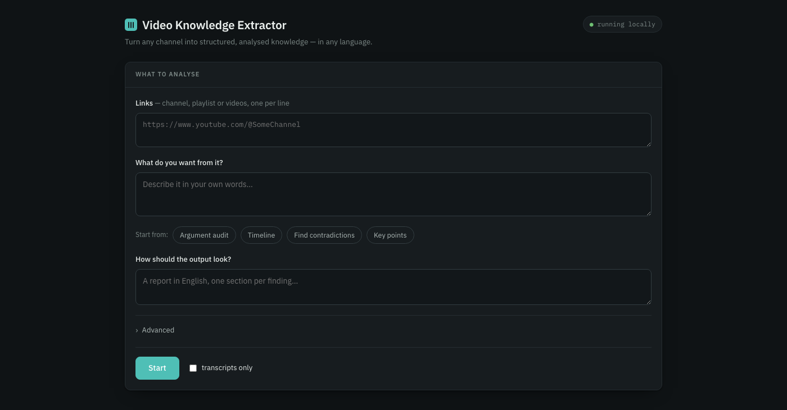

# video-knowledge-extractor

**Turn any YouTube channel into structured, analysed knowledge — in any language.**

Point it at a channel. Say what you want in plain English. Get back a document
you can read and JSON another tool can use.

```bash
vke run https://youtube.com/@SomeChannel \
  --ask "Identify every argument, tell me where each one is weakest, and how to fix it"
```

Most tools in this space download transcripts. That part is commodity. This one
is built for what comes after: **reading a whole body of work and telling you
what recurs in it.**

---

## Why it exists

Transcripts on their own don't tell you much. A hundred videos of transcripts
tell you less, because now you have to read them.

`vke` extracts structured records from every video, then does a second pass
across all of them to find the patterns — the objection you keep walking into,
the date you give three different ways, the claim that contradicts what you said
six videos ago.

It also works where caption-based tools simply cannot. YouTube auto-captions
roughly a dozen languages. Urdu is not one of them — an Urdu channel returns
**zero** caption tracks, of any kind. `vke` transcribes the audio instead, so the
other ~86 languages are in scope rather than out of it.

## Install

```bash
pip install video-knowledge-extractor            # core
pip install 'video-knowledge-extractor[asr]'     # + speech recognition
pip install 'video-knowledge-extractor[mlx]'     # Apple Silicon: several times faster
```

You also need [ffmpeg](https://ffmpeg.org) for audio, and something to do the
analysis — see [Analysis backends](#analysis-backends).

Run `vke providers` at any point to see which speech-recognition backends and
analysis models your machine can actually use, and which it would pick.

## Use it

You are not picking from a menu of features. You describe what you want.

```bash
# Audit your own arguments before an opponent does
vke run <url> --preset argument-audit

# A historical timeline, in English, from Urdu videos
vke run <url> --lang ur --output-language English \
  --ask "Build a chronological timeline of the events described, with who was
         involved and where. Flag any date given inconsistently."

# Contradictions across a whole channel
vke run <url> --preset contradictions

# Compare two speakers in a debate
vke run <url> --ask "Compare the two speakers. Who defended their position
                     better, on which specific points, and why?"

# Just the transcripts, nothing else
vke run <url> --transcribe-only
```

The tool reads your request, works out what fields the answer needs, and
extracts to that shape. A timeline gets timeline fields; an argument audit gets
argument fields. There's no vocabulary to learn.

`--preset` just pre-fills `--ask` with wording that works. Edit it, or ignore it.

## The interface

Prefer not to use a terminal? There's a local web interface:

```bash
vke ui
```

That opens `http://localhost:7864` in your browser. Three fields — paste links,
say what you want, say how the output should look — and everything else tucked
behind **Advanced** with working defaults.



It runs entirely on your machine. Nothing is uploaded, and the page is served by
the same core the CLI uses, so limits, pacing and checkpointing behave
identically either way.

Because transcription takes minutes rather than seconds, the interface shows live
per-video progress — what's transcribing now, what's finished, what's waiting on
an unreleased premiere — and results appear as they're extracted rather than all
at the end.

## What you get

Every run gets its own dated folder holding everything about it:

```
vke-data/
  runs/
    2026-09-11_1437_htM_SXcSuHI/
      run.json          what you asked, and how it was produced
      transcripts/      one per video, with provenance
      analysis.json     canonical, machine-readable
      analysis.md       the readable report
      analysis.docx     the same, as a Word document
      patterns.md       what recurs across every video (2+ videos)
      state.json        checkpoint for this run
  cache/
    transcripts/        keyed by video id, shared between runs
```

Transcription is the expensive step and depends only on the video, so
transcripts are cached and never produced twice — point a second run at the
same channel and it goes straight to analysis. Each transcript is also copied
into the run folder, so that folder stands alone if you move or send it.

Override either with `--outdir` and `--cache`.

Every record in `analysis.json` carries the same envelope regardless of what you
asked for:

```json
{
  "video_id": "ye3XuMTJz0Y",
  "timestamp": [42.5, 88.1],
  "speaker": "Host",
  "quote_original": "واجب الوجود ایسے وجود کو کہا جاتا ہے...",
  "confidence": "high",
  "record": { "...your fields..." }
}
```

`timestamp` is derived by matching the quote against the audio, not asked of the
model — a model will invent a plausible timestamp, and a wrong clip point is
worse than none. That makes the output directly usable by video tooling.

## Analysis backends

Bring your own key, use a subscription you already have, or run it free and
local. `vke providers` shows what works on your machine.

| `--provider` | Needs | Notes |
|---|---|---|
| `claude-cli` | Claude Code installed | Uses your existing subscription — no API key, no per-run cost |
| `anthropic` | `ANTHROPIC_API_KEY` | Best output quality |
| `openai` | `OPENAI_API_KEY` | |
| `ollama` | Ollama running locally | Free and offline; weaker, and less reliable at holding a schema |

## Speech recognition

All Whisper variants run the same weights, so this is a speed and platform
choice, not an accuracy one.

| `--asr` | Platform |
|---|---|
| `faster-whisper` *(default)* | Windows, Linux, macOS — CPU or NVIDIA |
| `mlx` | Apple Silicon only, roughly 5–7× realtime |

Pass `--captions en,ur` to use YouTube's captions when they exist and fall back
to transcription when they don't.

## Being a good citizen

Runs pause a random interval between requests, fetch one video at a time, back
off on errors, and never re-fetch finished work. The pause has a floor and
cannot be set to zero.

It warns before runs over 30 videos, and checks free disk space before
downloading a model or a video — aborting with a clear message rather than dying
half way. Progress is checkpointed per video, so nothing is lost.

**Not included, deliberately:** proxy rotation, fingerprint spoofing, or CAPTCHA
handling. Randomised pacing keeps you under rate limits; it does not disguise
automation, and we won't pretend otherwise.

**Please use it on public content**, to understand arguments — your own, or ones
you're engaging with. Not to build profiles of private individuals.

## Status

**v0.1 — early.** The pipeline works end to end. Not there yet:

- MCP server, so it works directly inside Claude, Cursor and similar
- Speaker attribution (word-level timestamps make this feasible)
- Watching the video, not just hearing it — on-screen text, charts, slides

## Notices

**Not affiliated with YouTube or Google.** This project is independent and is not
endorsed by, sponsored by, or connected to them in any way.

**You are responsible for how you use it.** Accessing YouTube programmatically may
conflict with YouTube's Terms of Service, and copyright in videos and their
transcripts belongs to their owners. This tool downloads nothing to any server we
run and redistributes no content — everything happens on your machine, and what
you do with the output is your responsibility, under the laws that apply to you.

**Analysis output is a language model's assessment, not verified fact.** It may be
wrong, and it may be confidently wrong. Check anything before relying on it, and
check it twice before publishing it.

**Please use it on public content**, to understand arguments — your own, or ones
you are engaging with. Not to build profiles of private individuals, and not to
harass anyone.

**No warranty.** As set out in the Apache-2.0 licence, this software is provided
"as is", without warranties or conditions of any kind, and the contributors are
not liable for any damages arising from its use.

## Licence

Apache-2.0. Built by [excoms.ai](https://excoms.ai).
